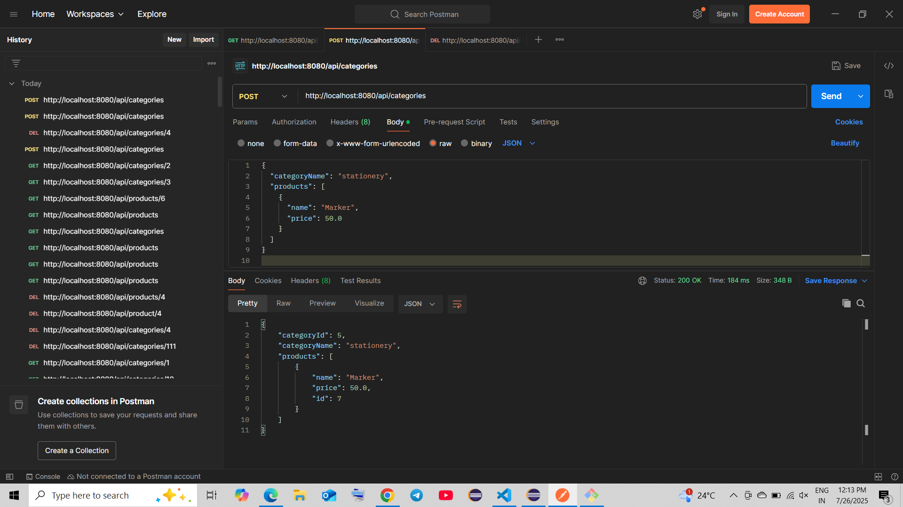
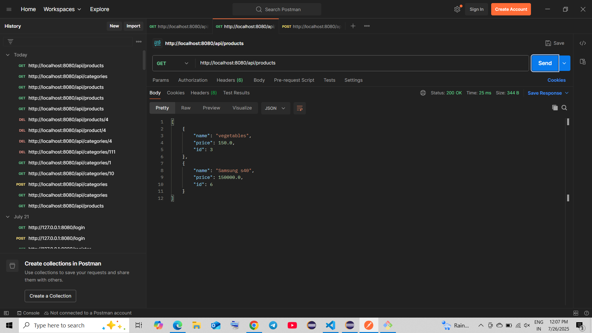

# 🛍️ Product & Category REST API

A RESTful API built using **Spring Boot**, **Hibernate ORM**, and tested with **Postman**. 
This service manages products and their associated categories, supporting full CRUD operations and relationship mapping.

## 🔧 Tech Stack

- Java 17 
- Spring Boot 3+
- Hibernate (JPA)
- MySQL 
- Postman (testing & documentation)

## 🧩 Entity Relationship

- One **Product** can belong to one **Category**
- One **Category** can contain multiple **Products**


## 🌐 API Endpoints

Here’s how to write endpoints in the README — use tables or bullet points with clear method, URL, and description:

### 🧠 Product Endpoints

| Method | Endpoint                | Description            |
|--------|-------------------------|------------------------|
| GET    | `/api/products`         | Get all products       |
| GET    | `/api/products/{id}`    | Get product by ID      |
| POST   | `/api/products`         | Create a product       |
| PUT    | `/api/products/{id}`    | Update a product       |
| DELETE | `/api/products/{id}`    | Delete a product       |

### 📂 Category Endpoints

| Method | Endpoint                  | Description            |
|--------|---------------------------|------------------------|
| GET    | `/api/categories`         | Get all categories     |
| GET    | `/api/categories/{id}`    | Get category by ID     |
| POST   | `/api/categories`         | Create a category      |
| PUT    | `/api/categories/{id}`    | Update a category      |
| DELETE | `/api/categories/{id}`    | Delete a category      |


## 🧪 Postman Testing


### 🔍 Postman Demo

Below are screenshots of key endpoint tests in Postman:

  
*Create a new Category*

  
*Retrieve all products*


## 🚀 How to Run Locally

```bash
# Clone the repo
https://github.com/sanjyot002/springboot-product-manager.git
cd springboot-product-manager

# Build and run
mvn clean install
mvn spring-boot:run


